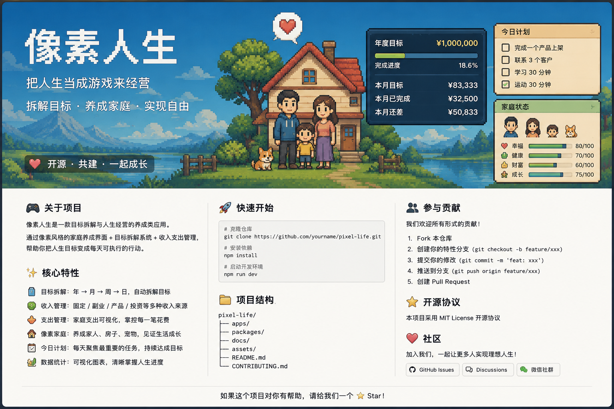

<p align="center">
  
</p>
# 🎮 像素人生 · Pixel Life

> **把人生当成一场游戏来经营。**

把一个遥远的人生目标，拆成今天可以完成的一件件小事。

**目标拆解 · 家庭养成 · 收入支出 · 每日行动 · AI 助力**

🚧 **项目正在开发中，欢迎一起共建。**

---

## 🌱 为什么做这个？

比如：

> 我想一年赚到 100 万。

听起来很大。

但拆开以后可能是：

```text
100 万 / 年
      ↓
8.3 万 / 月
      ↓
1.9 万 / 周
      ↓
今天该做什么？
```

**像素人生想做的，就是帮你从“我想要什么”，走到“我今天应该做什么”。**

---

## 🏠 像素人生

创建自己的家庭：

```text
👤 我
👩 伴侣
👶 子女
🏠 家
💰 收入
💸 支出
🎯 目标
```

然后慢慢经营。

赚钱、完成目标、改善生活，家庭也会一点点成长。

---

## ✨ 核心功能

* 🎯 **目标拆解**：年 → 月 → 周 → 日
* 💰 **收入管理**：固定 / 副业 / 生意 / 产品 / 投资
* 💸 **支出管理**：记录真实家庭开销
* 🏠 **像素家庭**：用养成的方式记录人生状态
* 📋 **今日计划**：每天只关注最重要的事情
* 📊 **目标进度**：随时知道距离目标还有多少
* 🧠 **Memory**：持续记录你的家庭、财务和人生状态
* 🤖 **AI 规划**：根据当前状态重新拆解目标

---

## 🚀 项目状态

目前处于：

**0 → 1 开发阶段**

先把最核心的闭环跑起来：

```text
创建家庭
   ↓
设置目标
   ↓
目标拆解
   ↓
生成今日任务
   ↓
完成任务
   ↓
更新人生状态
   ↓
继续下一天
```

---

## 🛠️ 开发计划

### Phase 1

* [ ] 项目初始化
* [ ] 数据库
* [ ] Memory

### Phase 2

* [ ] 家庭创建
* [ ] 收入 / 支出
* [ ] 目标系统

### Phase 3

* [ ] 自动目标拆解
* [ ] 今日任务
* [ ] Dashboard

### Phase 4

* [ ] 像素家庭
* [ ] 成长系统
* [ ] AI 目标规划

---

## 🤝 一起做

这是一个 **Open Source 共建项目**。

不要求你一定会写代码。

你可以贡献：

* 💡 产品想法
* 🎨 UI / 像素设计
* 💻 代码
* 🧠 AI Prompt
* 📊 数据模型
* 🐛 Bug
* 📝 文档
* 💬 使用体验

如果你觉得这个想法有意思：

**欢迎 Star、Issue、PR，一起把它做出来。**

---

## 📖 项目文档

详细产品设计：

`docs/PRODUCT.md`

开发计划：

`docs/ROADMAP.md`

贡献指南：

`CONTRIBUTING.md`

---

## ⭐ Star

如果你也觉得：

> **人生其实可以像游戏一样，一点一点养成。**

欢迎给项目一个 ⭐ Star。

然后一起看看：

**我们能不能把“想要的人生”，真的拆成每天可以完成的事情。**

---

## 📄 License

MIT License
